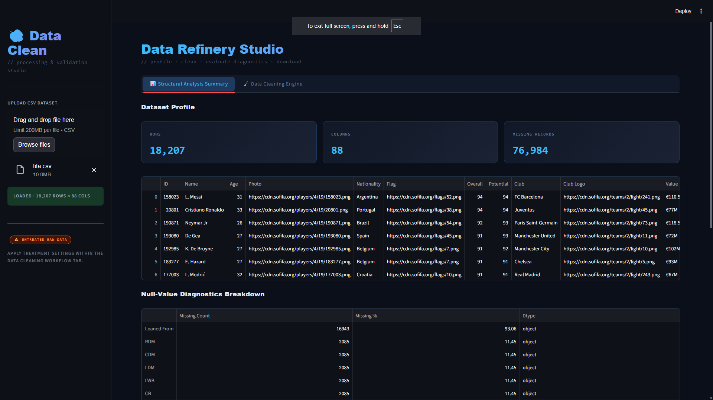
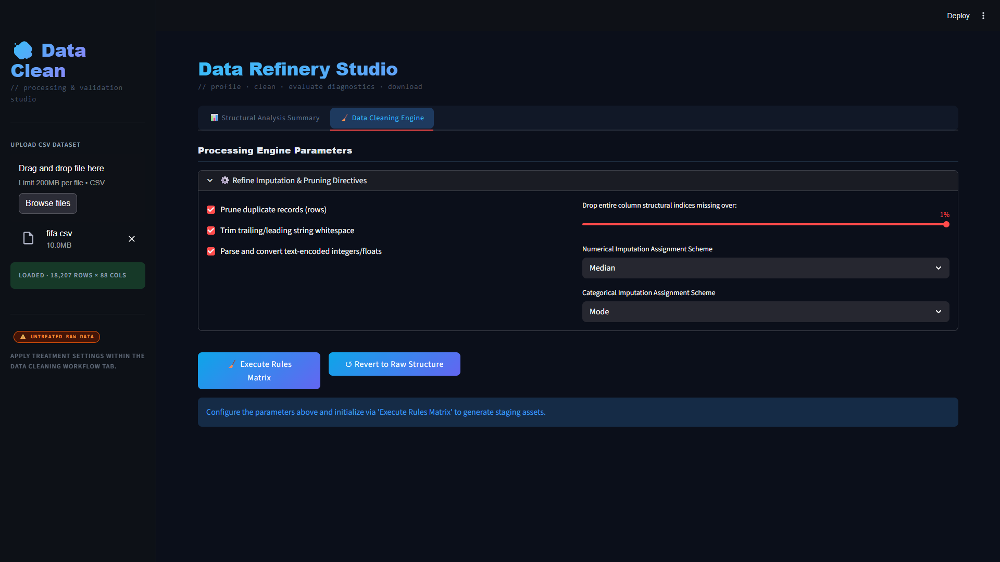
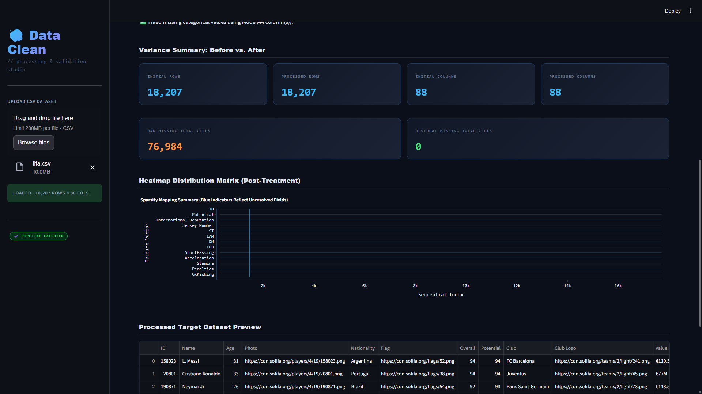

# 🧹 Data Refinery Studio

A sleek, automated data preprocessing and structural diagnostics workspace built with **Streamlit**, **Pandas**, and **Plotly**. This application isolates the tedious data-cleaning phase, allowing users to upload raw target datasets, evaluate structural missingness, execute multi-scheme data-cleaning matrices, and generate clean downstream CSV exports instantly.

---

## 📸 Application Interface

### 1. Structural Analysis Summary Tab
*Instantly map missing records and display deep descriptive feature statistics upon raw CSV upload.*

### 2. Data Cleaning Engine Tab
*Configure automated treatment rules, monitor execution operation logs, and inspect post-treatment integrity heatmaps before export.*

*After cleaning the data.*

---

## ✨ Features

- **Structural Analysis Dashboard:** Real-time summary statistics displaying total row counts, columns, and absolute missing cells at a glance.
- **Null-Value Diagnostics Breakdown:** Granular features profiling highlighting missing counts and percentage distributions sorted by priority.
- **Automated Processing Engine:** - Prunes duplicate records and trims trailing/leading string whitespace.
  - Automatically parses and safely converts text-encoded integers or floats.
  - Offers custom threshold sliders to drop entire columns missing excessive structural indices.
- **Multi-Scheme Imputation Assignment:** Separate configurable workflows for numerical elements (Median, Mean, Zero, or row dropping) and categorical fields (Mode, Constant 'Unknown', or row dropping).
- **Post-Treatment Variance Matrix:** Side-by-side metric comparison tracking initial vs. processed data variance and residual cell counts.
- **Sparsity Mapping Summary:** Renders dynamic Plotly heatmaps highlighting unresolved data coordinates.
- **Cached Export Utility Block:** Pre-compiled, memory-efficient downstream CSV downloads.

## 🛠️ Tech Stack

- **Interface Frontend:** Streamlit (with embedded Syne & JetBrains Mono web-typography rules)
- **Data Engineering:** Pandas, NumPy
- **Visual Diagnostics:** Plotly Express

## Deployed app
- https://datarefinerystudio.streamlit.app

